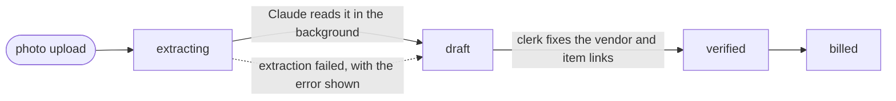

<div align="center">

# चलानी · chalaani

**A multi-tenant register for delivery chalani — photograph the slip, let Claude read it, get vendor-wise and item-wise totals for free.**

[](https://github.com/theArjun/chalaani/actions/workflows/tests.yml)
[](https://www.python.org/downloads/)
[](https://www.djangoproject.com/)
[](LICENSE)
[](#language-नेपाली--english)

</div>

---

A **delivery chalani** (चलानी / डेलिभरी चलान) is the paper slip a supplier sends
along with goods. This is the register for those slips: photograph one, let
Claude read it, have a clerk confirm the two things that matter — which supplier,
which catalog item — and the vendor-wise and item-wise totals fall out for free.

Built for how these slips actually look in Nepal: Bikram Sambat dates, Devanagari
digits and names, lakh/crore money, बोरा / थान / वर्ग फिट units, PAN numbers, and
Shrawan–Ashad fiscal years.

## Contents

- [Features](#features)
- [Stack](#stack)
- [Quick start](#quick-start)
- [How a chalani moves](#how-a-chalani-moves)
- [Configuration](#configuration)
- [MCP server](#mcp-server)
- [Language: नेपाली / English](#language-नेपाली--english)
- [Nepali support](#nepali-support)
- [Photos are not public](#photos-are-not-public)
- [Extraction](#extraction)
- [Theme](#theme)
- [Project layout](#project-layout)
- [Production notes](#production-notes)
- [Tests](#tests)
- [Contributing](#contributing)
- [Security](#security)
- [License](#license)

## Features

- **Photo in, ledger out.** Upload a slip; Claude extracts vendor, chalani number,
  BS date, vehicle, and every goods line into a draft a clerk confirms.
- **Multi-tenant by construction.** Every query is organization-scoped, including
  photo access; roles are owner, manager, and staff, and only the first two verify.
- **Bikram Sambat everywhere.** BS is the headline date in both languages, stored
  alongside an AD `DateField` so reports stay plain SQL.
- **Nepali numerals and money.** Lakh/crore grouping, Devanagari digits, and
  amounts spelled out in words.
- **Bilingual UI.** नेपाली by default, English one click away, switched from the navbar.
- **Reports.** Vendor-wise and item-wise totals per fiscal year, printable as a
  clean black-on-white table.
- **Agent-ready.** An MCP server exposes the register read-only by default, so an
  assistant can answer questions about it without a scraper.
- **No build step.** HTMX and Django partials instead of an SPA; SQLite and the
  ORM broker instead of Postgres and Redis.

## Stack

| Layer | Choice |
| --- | --- |
| Web | Django 6.1, one template per screen |
| Interactivity | HTMX 2 + Django's native `` (no build step, no SPA) |
| Styling | Tailwind 4 + daisyUI 5, custom `chalaani` theme (CDN while prototyping, standalone binary for prod) |
| Extraction | LangChain `ChatAnthropic(...).with_structured_output(ChalaniExtraction)` |
| Jobs | Django-Q2 on the ORM broker (no Redis) |
| Storage | SQLite + a `MEDIA_ROOT` outside the repo, served only through an org-checked view |
| Dates | `nepali-datetime`, wrapped in `nepal/dates.py` |
| Agents | An MCP server named `chalaani` (`manage.py mcp`) |
| Language | Django i18n — नेपाली (default) and English, switched from the navbar |

## Quick start

**Requirements:** Python 3.12+ and [uv](https://docs.astral.sh/uv/). An
[Anthropic API key](https://console.anthropic.com/) is optional — without one the
app runs fine and you type the slips in by hand.

```bash
git clone https://github.com/theArjun/chalaani.git
cd chalaani

uv sync
cp .env.example .env          # add ANTHROPIC_API_KEY to use the AI reading
uv run python manage.py migrate
uv run python manage.py seed_demo     # demo firm, 5 suppliers, 24 chalani
uv run python manage.py runserver
```

Open <http://127.0.0.1:8000/> and log in as **`demo` / `demo12345`**, or create
your own firm at `/accounts/signup/`.

For AI extraction, run the worker next to the web process:

```bash
uv run python manage.py qcluster
```

…or set `Q_SYNC=1` to read photos inline (blocks the upload request — demo only).
To read one chalani without a worker at all:

```bash
uv run python manage.py extract_chalani 12
```

## How a chalani moves



- **`description` keeps what the paper said. `item` is the catalog link a clerk
  sets during verification.** That split is what makes vendor-wise reporting
  possible without falsifying the slip.
- Matching is deliberately conservative (PAN first, then exact name, then a
  0.86-cutoff fuzzy match across both Devanagari and romanised names). Anything
  below the bar stays unlinked and the verify screen asks a human — a wrong
  vendor link is far more expensive than an unlinked draft.
- The uniqueness constraint applies **only to verified/billed** chalani, and
  exempts blank numbers, so an AI draft with a misread number never blocks a save
  and several numberless drafts can coexist.
- Extraction failures always land on an editable draft with the error shown,
  never a 500.

## Configuration

Everything is read from the environment (or a `.env` file). Copy `.env.example`
and edit; the defaults below are what you get if you set nothing.

| Variable | Default | What it does |
| --- | --- | --- |
| `DJANGO_SECRET_KEY` | insecure dev key | **Set a real one in production.** |
| `DJANGO_DEBUG` | `1` | Set to `0` in production. |
| `DJANGO_ALLOWED_HOSTS` | `*` | Comma-separated hostnames. |
| `DJANGO_CSRF_TRUSTED_ORIGINS` | empty | Comma-separated origins, needed behind HTTPS. |
| `DJANGO_LANGUAGE_CODE` | `ne` | UI language for a first-time visitor: `ne` or `en`. |
| `DJANGO_DB_PATH` | `./db.sqlite3` | SQLite file location. |
| `CHALAANI_MEDIA_ROOT` | `~/.chalaani/media` | Where uploaded photos live. Back it up with the database. |
| `ANTHROPIC_API_KEY` | empty | Required only for AI reading of photos. |
| `CHALAANI_EXTRACTION_MODEL` | `claude-opus-5` | Model used for extraction. |
| `CHALAANI_EXTRACTION_EFFORT` | `medium` | Reasoning effort for that model. |
| `CHALAANI_EXTRACTION_ENABLED` | `1` | `0` disables AI reading entirely. |
| `Q_SYNC` | `0` | `1` runs extraction inline in the request — demo only. |
| `Q_WORKERS` | `2` | Django-Q2 worker count. |
| `CHALAANI_TAILWIND_CDN` | `1` | `0` serves the built `static/css/build.css` instead. |

## MCP server

The register is also exposed over the [Model Context Protocol](https://modelcontextprotocol.io/),
so an assistant can answer "what did Himal Cement deliver this fiscal year?"
without a scraper. The server is named **`chalaani`**:

```bash
uv run python manage.py mcp --list-orgs           # which firms can be served
uv run python manage.py mcp --org demo-nirman-sewa
uv run python manage.py mcp --org demo-nirman-sewa --allow-writes
uv run python manage.py mcp --org demo-nirman-sewa --transport streamable-http --port 8931
```

<details>
<summary><strong>Client config (stdio)</strong></summary>

Add this to your MCP client's config — for Claude Desktop that is
`~/Library/Application Support/Claude/claude_desktop_config.json` on macOS — then
restart the client. Add `"--allow-writes"` to `args` if you want the assistant to
be able to change data.

```json
{
  "mcpServers": {
    "chalaani": {
      "command": "uv",
      "args": [
        "run", "--directory", "/path/to/chalaani",
        "python", "manage.py", "mcp", "--org", "demo-nirman-sewa"
      ]
    }
  }
}
```

</details>

| Tool | What it returns |
| --- | --- |
| `list_chalani` | filter by status, vendor, fiscal year, BS date range, free text |
| `get_chalani` | one chalani with its goods lines and what blocks verification |
| `search_vendors` / `search_items` | catalog lookup, either script or PAN |
| `vendor_report` | vendor-wise and item-wise totals for a fiscal year |
| `register_summary` | current-FY counts and totals |
| `pending_verification` | drafts still waiting, each with its reason |
| `convert_date` | BS ↔ AD, plus weekday and fiscal year |
| `update_chalani`, `link_line_item`, `verify_chalani` | **only with `--allow-writes`** |

Two rules hold the tenancy boundary: the organization is pinned once at startup
(`--org`) and bound into every tool, so it never appears in a tool schema and a
caller cannot ask for another firm's data; and the tools that change data are not
registered at all unless the operator passes `--allow-writes`. Dates cross the
boundary as Bikram Sambat — `date_bs` alongside the Gregorian `date_ad`.

## Language: नेपाली / English

The whole UI is translatable through Django's own i18n machinery —
`LocaleMiddleware`, `gettext_lazy` in Python, `` in templates, a
catalog in `locale/ne/LC_MESSAGES/`. English is the msgid language, Nepali the
translation. The navbar has a switcher that posts to
`django.views.i18n.set_language`, so the choice sticks in a cookie; a first-time
visitor gets Nepali (`LANGUAGE_CODE=ne`), or whatever `Accept-Language` asks for.

**Switching the UI to English does not switch the calendar.** Bikram Sambat stays
the headline date everywhere — only the script changes:

| | नेपाली | English |
| --- | --- | --- |
| Date | १७ भदौ २०८२ | 17 Bhadau 2082 |
| Long date | मंगलबार, १७ भदौ २०८२ | Mangalbar, 17 Bhadau 2082 |
| Money | रू. १२,३४,५६७.५० | Rs. 12,34,567.50 |
| In words | बाह्र लाख चौँतिस हजार … | twelve lakh thirty-four thousand … |
| Unit | बोरा | Bag / Sack |
| Relative | २४ दिन अघि | 24 days ago |

The Gregorian date is kept as a small annotation (and as the `title=` tooltip),
never as the primary reading. Every list and detail view also shows a relative
age — `24 days ago` / `२४ दिन अघि` — next to the absolute date, via the `|ago`
filter, which localises its own plurals.

After changing any user-facing string:

```bash
uv run python manage.py makemessages -l ne --ignore=.venv
# translate the new msgids in locale/ne/LC_MESSAGES/django.po
uv run python manage.py compilemessages -l ne --ignore=.venv
```

## Nepali support

`nepal/` is a self-contained app you could lift into another project:

| Module | What it does |
| --- | --- |
| `dates.py` | BS↔AD, `२०८२।०५।१७` parsing, `१७ भदौ २०८२` display, fiscal years (`2082/83`) and their AD bounds |
| `numbers.py` | `12,34,567.50` lakh/crore grouping, Devanagari digits, `एक हजार दुई सय पचास रुपैयाँ मात्र` |
| `units.py` | Canonical units with alias folding: `Bora`/`बोरा`/`bags`/`sack` → `bag` |
| `validators.py` | 9-digit PAN, Nepali mobile/landline, permissive vehicle plates |
| `forms.py` | `BikramSambatDateField` + an HTMX input that previews the AD date as you type |
| `templatetags/nepal.py` | Language-aware filters: `\|bs_date` `\|bs_date_long` `\|money` `\|num` `\|qty` `\|in_words` `\|unit_label` `\|fy` `\|ago` |

Dates are stored as an AD `DateField` (so ordering, ranges and reports are plain
SQL) with the BS string kept alongside exactly as written; `Chalani.sync_dates()`
keeps the two and the fiscal year consistent, and treats the BS string as
authoritative because that is what the paper says.

## Photos are not public

`MEDIA_ROOT` sits outside the repo (`~/.chalaani/media` by default) and
`MEDIA_URL` is deliberately `None`. Uploads are stored at
`chalani/<org_id>/<uuid>.<ext>` and served **only** by `chalani:photo`, which
resolves the chalani through the caller's organization first. Back up
`MEDIA_ROOT` together with the database — one is useless without the other.

## Extraction

`extraction/schema.py` is the whole contract; `extraction/prompts.py` carries the
Nepali-specific instructions (script fidelity, BS dates, Devanagari digits, unit
names, never compute a missing number). The call is:

```python
ChatAnthropic(model="claude-opus-5", ...).with_structured_output(
    ChalaniExtraction, method="json_schema"
).invoke([SystemMessage(...), HumanMessage(content=[image_block, text_block])])
```

Every field is optional on purpose: a `null` a clerk fills in beats a confident
guess that silently enters the books.

## Theme

`static/css/theme.css` defines a daisyUI 5 theme called `chalaani` in plain CSS,
so the CDN path and the built path render identically. It reads as a ledger
rather than a dashboard: hairline borders instead of drop shadows, squared
corners, deep navy primary with Nepali crimson kept for accents only, uppercase
micro-labels on table headers, tabular figures everywhere a number can line up in
a column, and tinted status chips that stay quiet across two hundred rows. Light
and dark are both designed (not auto-inverted); the navbar control writes the
choice to `localStorage`, and an inline script in `<head>` applies it before first
paint so there is no flash.

The header menus are native `<details>`/`<summary>`, not daisyUI's default
`div.dropdown`. That default only opens on `:focus-within`, so if the trigger
never takes focus the menu silently stays `display: none` — which is exactly what
happened here, leaving the firm switcher and the log-out menu unopenable.
`<details>` is excluded from daisyUI's hide rule and opens on click with no focus
dependency and no JS (a few lines close it on outside-click or Escape). The
language switcher went further and stopped being a menu at all: with two
languages, a segmented control is one click and cannot fail to open. There is a
print stylesheet too — a register or a report prints as a clean black-on-white
table.

## Project layout

```
chalaani/
├── config/         Django settings, URLs, ASGI/WSGI
├── accounts/       Sign-up, login, the user model
├── orgs/           Organizations, memberships, roles, tenancy middleware and mixins
├── chalani/        The register: models, views, services, the MCP server
├── extraction/     Claude schema, prompts, chain, background task
├── nepal/          BS dates, lakh/crore numbers, units, validators, template filters
├── locale/ne/      Nepali message catalog
├── static/         Theme CSS and assets
└── templates/      One template per screen, plus HTMX partials
```

## Production notes

- Tailwind without Node — download the standalone binary, then
  `./tailwindcss -i static/css/app.css -o static/css/build.css --minify`, set
  `CHALAANI_TAILWIND_CDN=0`, and `collectstatic`.
- Run `manage.py qcluster` under the same supervisor as the web process.
- Set `DJANGO_DEBUG=0`, a real `DJANGO_SECRET_KEY`, and `DJANGO_ALLOWED_HOSTS`.
- SQLite is in WAL mode and is fine for a single server; the models carry no
  Postgres-specific features if you outgrow it.

## Tests

```bash
uv run python manage.py test
```

The suite covers BS/AD conversion and fiscal-year edges, lakh/crore formatting, unit
folding, tenancy isolation (including photo access), the partial-unique
constraint, extraction application and its failure path, the HTMX fragments, the
verify/role rules, localisation — including the rule that an English UI still
renders Bikram Sambat dates — and the MCP surface (org scoping, write gating, and
that `organization` never reaches a tool schema).

## Contributing

Issues and pull requests are welcome. See [CONTRIBUTING.md](CONTRIBUTING.md) for
the dev setup, the translation workflow, and what a good pull request looks like.
Everyone taking part is expected to follow the
[Code of Conduct](CODE_OF_CONDUCT.md).

## Security

Please do not open a public issue for a vulnerability. See
[SECURITY.md](SECURITY.md) for how to report one privately.

## License

[MIT](LICENSE) © Arjun Adhikari
